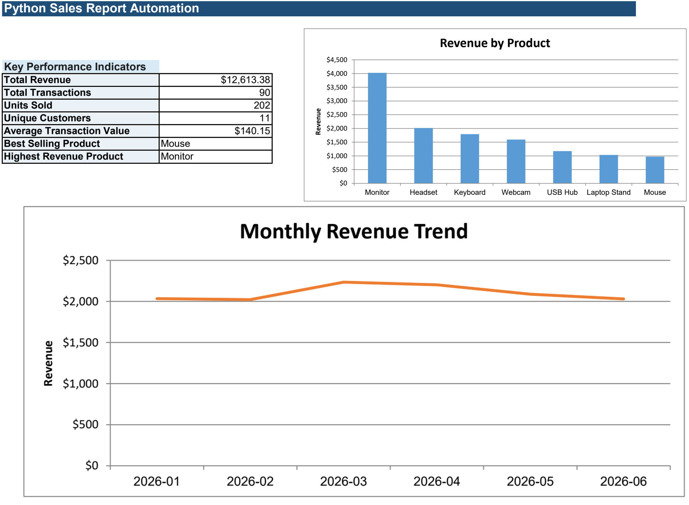

# Python Sales Report Automation

Python Sales Report Automation turns a raw sales CSV into a clean, easy-to-read Excel management report. It is a small portfolio project that demonstrates a practical workflow for handling imperfect business data without requiring a database or web application.

Raw CSV -> Python cleans and validates the data -> business metrics are calculated -> Excel management report is generated.

## Preview



## Features

- Reads a sales CSV with a simple six-column format.
- Normalizes headers, trims text, safely parses dates and converts numeric fields.
- Removes blank rows and duplicate records.
- Replaces missing customer names with `Unknown`.
- Keeps invalid records in a separate rejected-rows list instead of failing unexpectedly.
- Calculates revenue, key performance indicators, product performance and monthly results.
- Creates a formatted Excel workbook with KPI cards, five worksheets and charts.
- Supports default paths or custom input and output paths from the command line.

## Example workflow

1. Place a raw export in CSV format in `data/`.
2. Run the program.
3. Review the generated workbook in `output/sales_report.xlsx`.
4. Use the **Rejected Rows** sheet to correct source-data issues if needed.

## Project structure

```text
sales-report-automation/
├── data/
│   └── sample_sales.csv       # Realistic sample data, including safe test errors
├── output/
│   └── sales_report.xlsx      # Generated after running the program
├── src/
│   ├── data_cleaner.py        # Cleaning and validation
│   ├── analytics.py           # KPI and aggregation calculations
│   └── report_generator.py    # Excel formatting and charts
├── tests/
├── main.py
├── requirements.txt
├── README.md
└── PORTFOLIO.md
```

## Installation

This project uses Python 3.12.

```bash
python -m venv .venv
```

Activate the virtual environment for your operating system, then install the project packages:

```bash
pip install -r requirements.txt
```

## Usage

Run with the included sample file and default output location:

```bash
python main.py
```

Or provide custom paths:

```bash
python main.py --input path/to/file.csv --output path/to/report.xlsx
```

The command prints the input, valid and rejected row counts followed by the location of the generated report. If the source file is missing or required columns are not present, it prints a clear error message.

## Input format

The CSV must contain these columns:

| Column | Description |
| --- | --- |
| `Date` | Sale date, preferably in `YYYY-MM-DD` format |
| `Product` | Name of the sold product |
| `Category` | Product category |
| `Quantity` | Positive number of units sold |
| `Unit Price` | Non-negative price per unit |
| `Customer` | Customer name; a blank value becomes `Unknown` |

The included sample intentionally contains duplicates, missing customer values, surrounding whitespace, invalid dates, invalid quantities and prices, and a blank row. These cases demonstrate the validation workflow.

## Output workbook

The generated Excel file contains:

- **Summary** — key metrics, best-selling product and two business charts.
- **Cleaned Data** — valid sales records with calculated revenue.
- **Product Performance** — units, transactions, revenue and average selling price by product.
- **Monthly Report** — monthly transactions, units sold and revenue.
- **Rejected Rows** — rows that failed validation, retained for review.

The Summary sheet includes Total Revenue, Total Transactions, Units Sold, Unique Customers, Average Transaction Value, Best Selling Product and Highest Revenue Product. It also includes Revenue by Product and Monthly Revenue Trend charts.

## Technologies used

- Python 3.12
- pandas
- XlsxWriter
- pytest

## Business use cases

This workflow is useful for a small business or operations team that receives recurring CSV exports and needs a consistent report without manually cleaning every file in Excel. It can support sales reviews, product comparisons, monthly trend discussions and data-quality checks. The sample data and report are for demonstration only; this project does not claim use by a real company or client.
